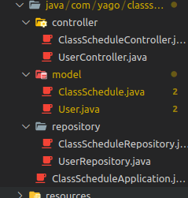
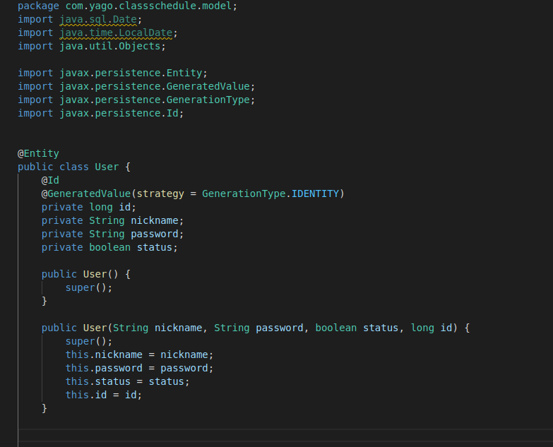
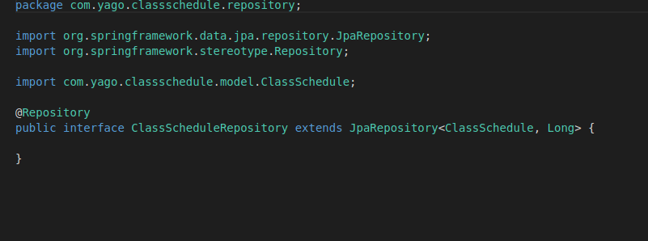

# Agenda de cadastro de aulas
> Projeto desenvolvido para exibição de Crud por Yago Marialva Bentes.

O Sistema Agenda de cadastro de aulas é um projeto desenvolvido em angular para aplicação dos conceitos de criar e ler dados

## Instalação

O projeto é composto de duas partes: o frontend em angular e o backend em java spring boot(principal).

Para instalar o frontend, deve-se clonar o seguinte repositório:
`https://github.com/yagomarialva/class-scheduler-frontend` 

## Estrutura do projeto

O Sistema foi desenvovido no modelo MVC onde a agenda criada controla o cadastro de aulas:

Um controller para as funções de get e post

O model para dar a estrutura a ser seguida pelo anterior:

E por fim o repositório do projeto para usar as funcionalidades do spring boot:

## Histórico de lançamentos

* 0.0.1
    * Primeira interação do sistema

## Meta

Yago Marialva Bentes – yago.marialva@gmail.com

[https://github.com/yagomarialva](https://github.com/yagomarialva)

## Contributing

1. Faça o _fork_ do projeto (<https://github.com/yagomarialva/portifolio-site/fork>)
2. Crie uma _branch_ para sua modificação (`git checkout -b feature/fooBar`)
3. Faça o _commit_ (`git commit -am 'Add some fooBar'`)
4. _Push_ (`git push origin feature/fooBar`)
5. Crie um novo _Pull Request_
